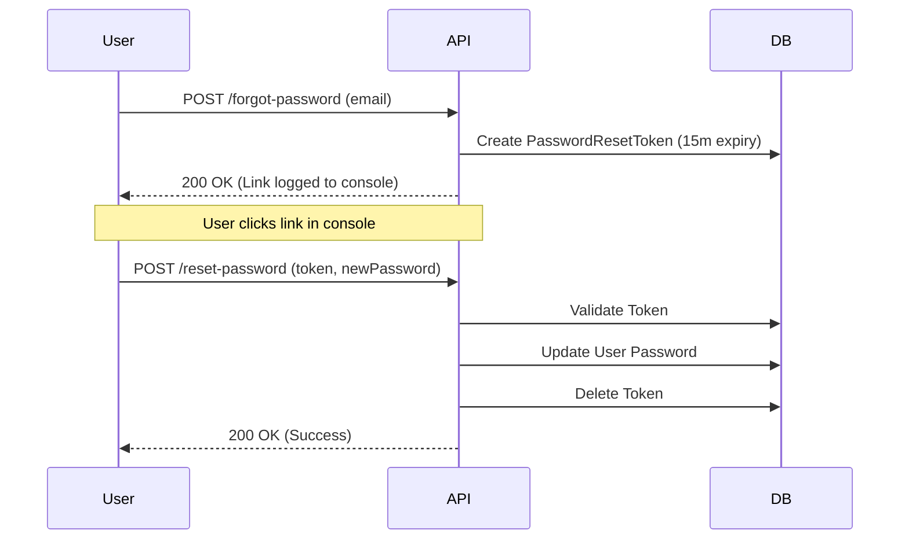

# Password Operations API Reference — VTC Sahra

Documentation for password-related operations, including unauthenticated recovery and authenticated password changes.

---

## 🔐 1. Forgot Password (Token-Based)

Use this flow when a user has forgotten their password.

### 1a. Request Reset Link
#### `POST /api/auth/forgot-password`
Generates a unique reset token and "sends" it to the user.

**Request Body**
```json
{
  "email": "user@vtc.dz"
}
```

**Success Response** — `200 OK`
```json
{
  "message": "Reset link sent to email (check console for now)"
}
```

---

### 1b. Reset Password
#### `POST /api/auth/reset-password`
Updates the password using the token received in the reset link.

**Request Body**
```json
{
  "token": "dbe8e833ea24...",
  "newPassword": "NewSecurePassword123!",
  "confirmPassword": "NewSecurePassword123!"
}
```

**Success Response** — `200 OK`
```json
{
  "message": "Password reset successfully"
}
```

**Error Responses**
| Status | Condition |
|--------|-----------|
| `400`  | Passwords do not match |
| `400`  | Invalid or expired token |
| `400`  | New password is the same as the old one |

---

## 🔑 2. Change Password (Authenticated)

Use this flow when a logged-in user wants to update their password.

#### `POST /api/auth/change-password`

> **Auth**: `Bearer <jwt_token>` required

**Request Body**
```json
{
  "oldPassword": "CurrentPassword123!",
  "newPassword": "NewSecurePassword456!",
  "confirmPassword": "NewSecurePassword456!"
}
```

**Success Response** — `200 OK`
```json
{
  "message": "Password changed successfully"
}
```

**Error Responses**
| Status | Condition |
|--------|-----------|
| `400`  | Missing fields or mismatched new passwords |
| `400`  | New password is the same as the old one |
| `403`  | Invalid `oldPassword` |

---

## 📉 Workflow Diagram (Forgot Password)



---

**Version**: 1.0.0  
**Last Updated**: March 2026
